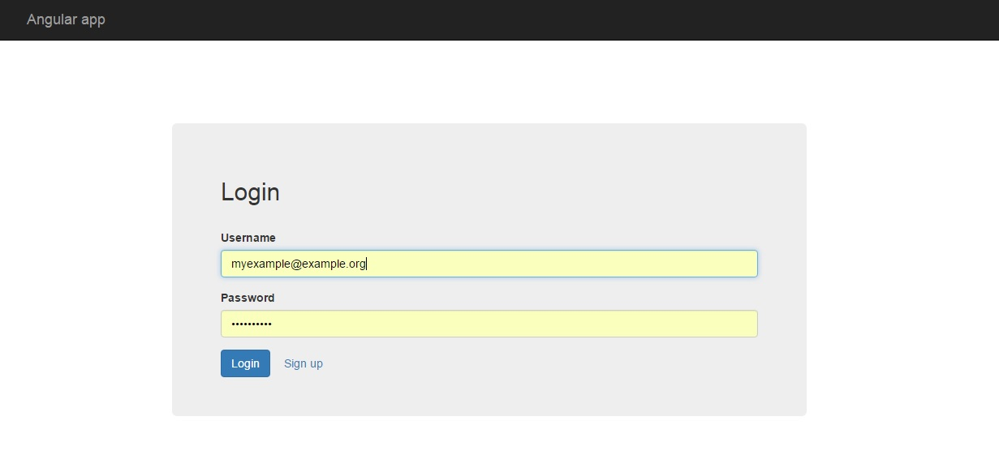
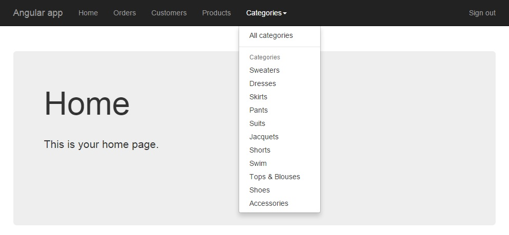
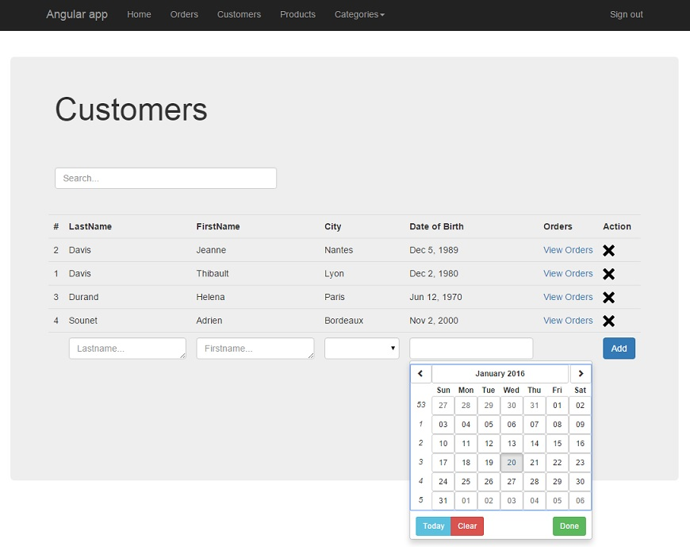
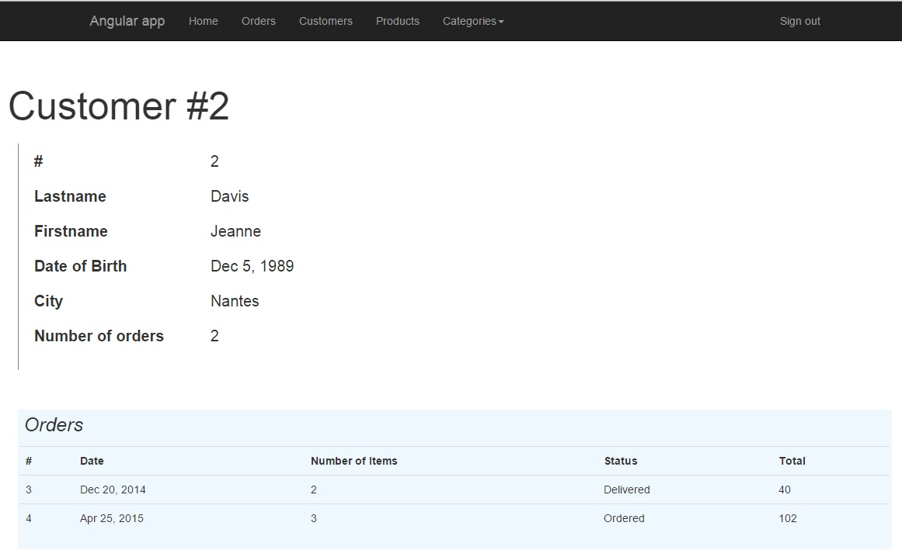
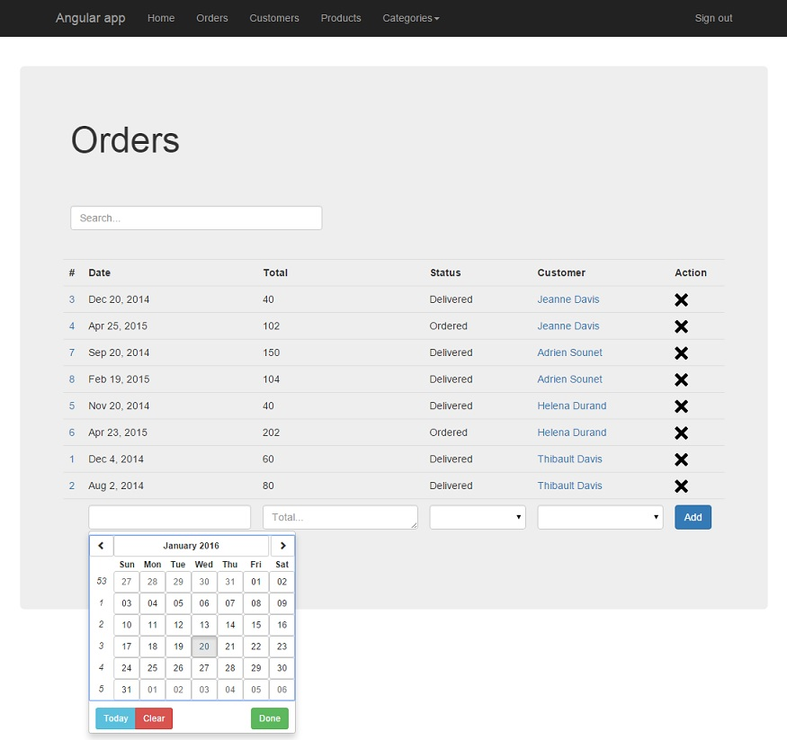
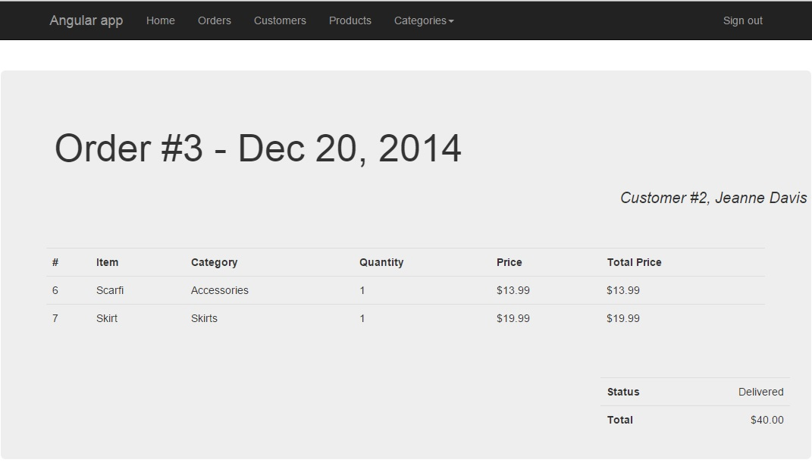
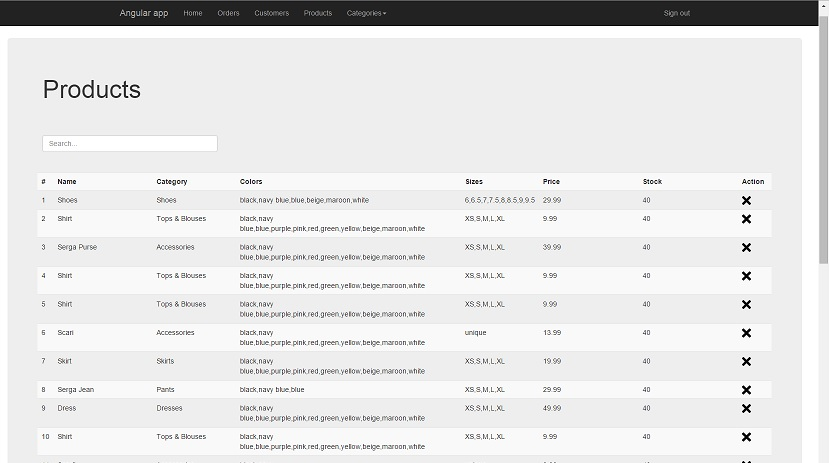
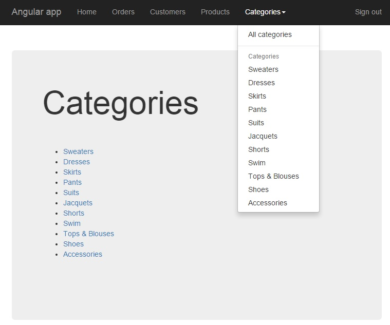
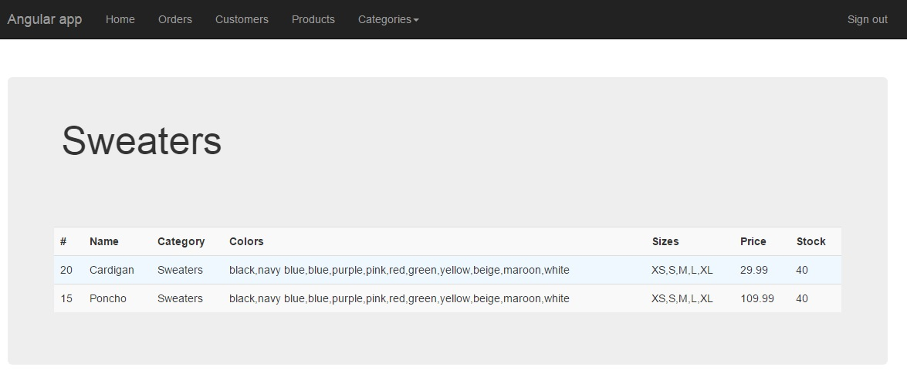

# orders_application

Angular application which displays orders, products and customers.
A user can:
- login/logout
- signup
- see all the orders, add an order, remove an order
- see all the customers, add a customer, remove a customer
- see all the products, add a product, remove a product
- see the different categories and the list of products in each category
- see a specific order by clicking on it in the list of orders
- see a specific customer by clicking on it in the list of customers

I needed a backend application and a database to deal with in order to test this angular application.
For that I have installed and used MONGO locally and I have created a NodeJS/ExpressJS application to deal with MONGO. I wont provide my NodeJs implementation here.

In order to see what the application looks like, I add some screenshots here.

Login page (same design as signup page)

Home page with navigation bar once the user is logged

Page with all the customers - possibility to add a customer by filling the input fields, the customer is added dynamically and is displayed as soon as the add button is pressed.

By clicking on a row, the user is directed to a detailed customer page

Page with all the orders - possibility to add an order by filling the input fields, the order is added dynamically and is displayed as soon as the add button is pressed.

By clicking on a row, the user is directed to a detailed order page

Page with all the products - possibility to add a product by filling the input fields, the product is added dynamically and is displayed as soon as the add button is pressed.

Page showing all the categories

Page showing a specific category and the available products in this category.
